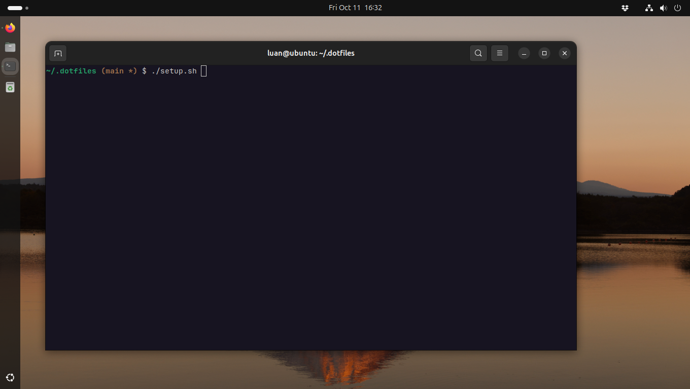
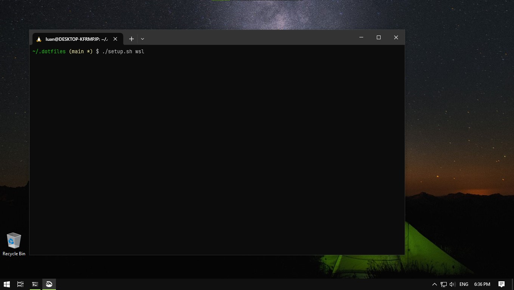

# ~/.dotfiles

this script is intended to setup a fresh installation of **Ubuntu** (including wsl).





## running

### 1. execute the bootstrap script

this scrtipt will install git and download this repository into your machine as `~/.dotfiles`

```
wget -qO - https://raw.githubusercontent.com/luanrv00/dotfiles/refs/heads/main/bootstrap.sh | bash
```

### 2. run setup script

**to setup all dotfiles for all available modules:**

```
.dotfiles/setup.sh
```

**to setup all dotfiles for wsl:**

```
.dotfiles/setup.sh wsl
```

**to install just a specific module:**

```
.dotfiles/setup.sh <module> # e.g .dotfiles/setup.sh vim
```

## keybindings for vim

| key binding | action                              |
| :---------- | :---------------------------------- |
| `<leader>t` | open/close **NERDTree** |
| `<tab>`     | navigate through tabs |
| `gd`        | open documentation for code fragment under cursor |
| `gi`        | go to implementation of code fragment under cursor |

## aliases for bash

| alias       | command                              |
| :---------- | :---------------------------------- |
| ls          | `ls -hl --color=auto` |
| lsa         | `ls -hlA --color=auto` |
|             |  |
| d           | `docker` |
| c           | `docker-compose` |
|             |  |
| t           | `tmux` |
| tn          | `tmux new -s` |
| ta          | `tmux attach -t` |
| tk          | `tmux kill-session -t` |
| tls         | `tmux list-session` |
| tx          | `tmuxinator` |
| txs         | `tmuxinator start` |
| txe         | `tmuxinator edit` |
|             |  |
| g           | `git` |
| gs           | `git status` |
| gl           | `git log` |
| glc           | `git log --pretty=format:'%Cred%h%Creset -%C(yellow)%d%Creset %s %Cgreen(%cr) %C(bold blue)<%an>%Creset'` |
| glg           | `git --graph --pretty=format:'%Cred%h%Creset -%C(yellow)%d%Creset %s %Cgreen(%cr) %C(bold blue)<%an>%Creset'` |
|             |  |
| gd           | `git diff` |
| gds           | `git diff --staged` |
|             |  |
| gcl           | `git clone` |
| gck           | `git checkout` |
| gckm           | `git checkout main` |
|               |  |
| gaa           | `git add -A` |
| gc           | `git commit` |
| gcm           | `git commit -m` |
| gca           | `git commit --amend` |
| gcaa           | `git commit --all` |
| gcme           | `git commit --allow-empty` |
|               | |
| gb           | `git branch` |
| gba           | `git branch -a` |
| gbm           | `git branch -m` |
| gbd           | `git branch -D` |
|               | |
| grb           | `git rebase` |
| grbm           | `git rebase main` |
| grbi           | `git rebase -i` |
| grba           | `git rebase --abort` |
| grbc           | `git rebase --continue` |
| grbs           | `git rebase --skip` |
|               |  |
| gr           | `git restore` |
| grs           | `git restore --staged` |
| grr           | `git reset` |
|               |  |
| gpl           | `git pull` |
| gps           | `git push` |
|               |  |
| gcp           | `git cherry-pick` |
| gcpa           | `git cherry-pick --abort` |
|               |  |
| gst           | `git stash` |
| gsta           | `git stash apply` |
| gstd           | `git stash drop` |
| gstl           | `git stash list` |
| gstad           | `git stash apply && git stash drop` |
